**JDMARKET[JAPAN DOMESTIC MARKET]**

**Identification of the problem you are trying to solve by building this particular marketplace app.**
JDM or (Japanese Domestic Market) refers to vehicles from Japan's home market, and is generally accepted as the vehicles and parts that were designed under Japanese regulations for Japanese buyers. Since the 90's, the worldwide popularity has grown for JDMs, and many car enthusiasts seek to either buy or sell their precious japanese cars. 

**Why is it a problem that needs solving?**
Despite the worldwide popularity in JDMs, there are still no well known dedicated two sided marketplace for them. This is why my marketplace is designed to solve this problem, and to allow car enthusiasts to browse, buy and list their own JDMS for sale. 

**A link (URL) to your deployed app (i.e. website)**

A link to the web app is listed below.

https://thawing-escarpment-15469.herokuapp.com/

**A link to your GitHub repository (repo).**

A link to GitHub is also provided below.

https://github.com/Marcohylo

**Description of your marketplace app (website), including:**
- Purpose
- Functionality / features
- Sitemap
- Screenshots
- Target audience
- Tech stack (e.g. html, css, deployment platform, etc)

**Purpose**
The purpose of JDMarket is to provide the Australian public a platform where users can make/view listings of various JDM cars within Australia. In addition to this, JDMarket tries its best to provide a friendly user interface. 

**Functionality / features**
JDMarket is a marketplace website that consists and is made up of several databases. It also features a user creation option, which allows viewers of the website to create their own "user" before making their own listings. There is also an admin dashboard that is only accessible if the user is confirmed to be an administrator account, and it allows edits and changes to be made to other users or listings from it. In addition to this, payment through stripe has also been enabled. 

**Sitemap**

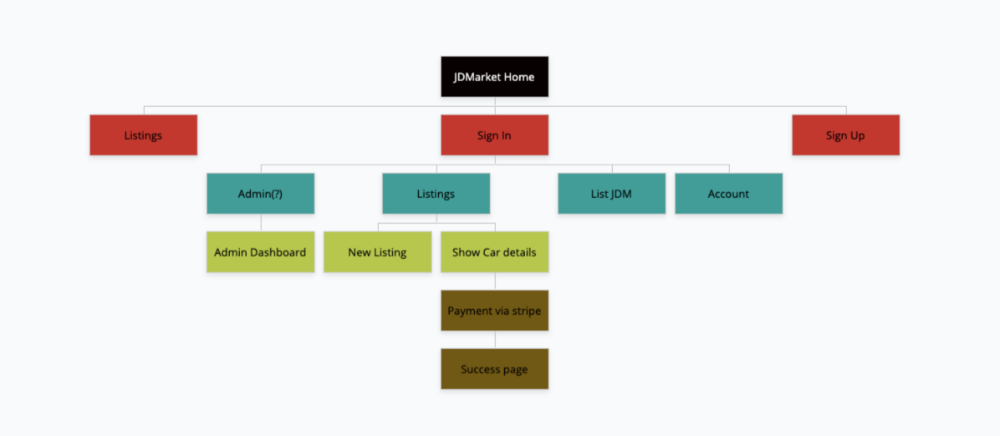

**Screenshots**

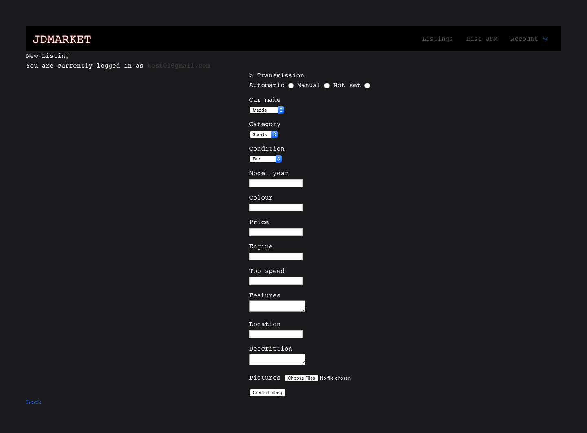
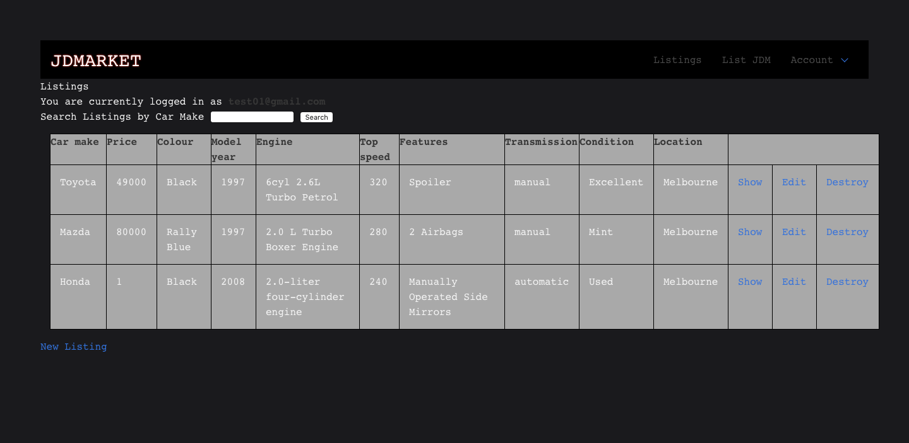
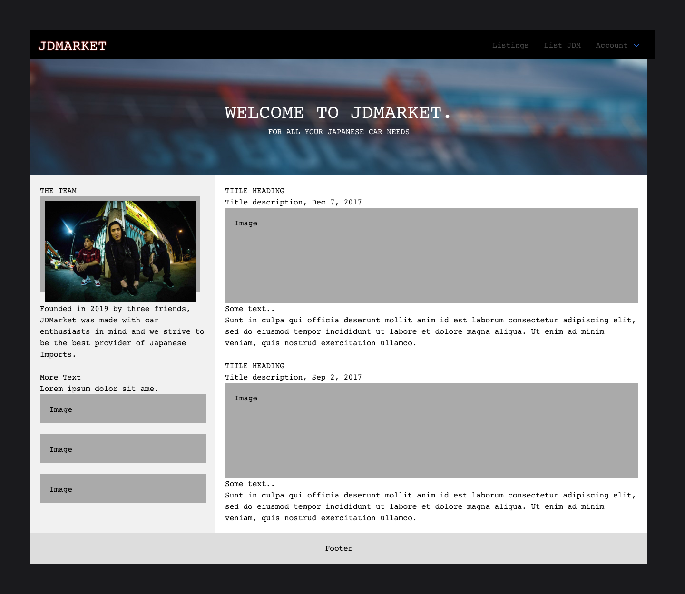
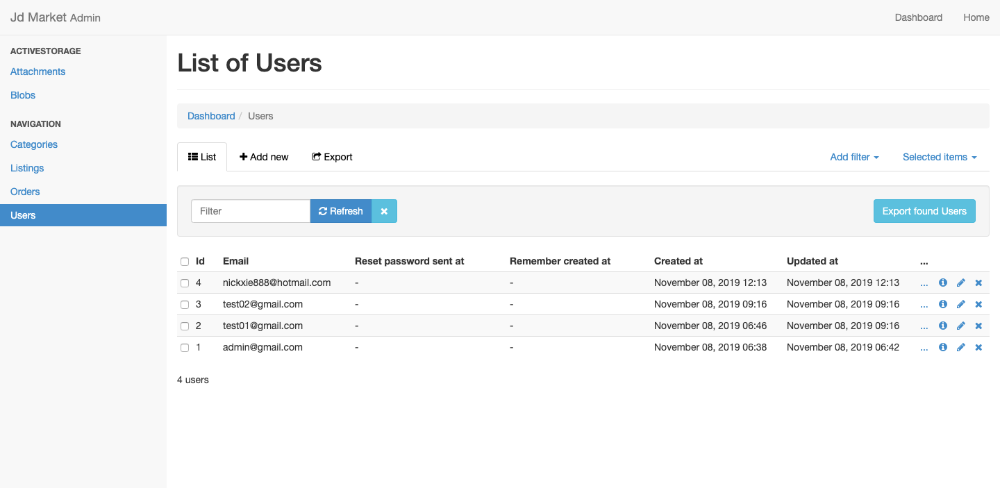

**Target audience**
JDMarket is made for car enthusiasts in mind, but it is definitely not just restricted to them. Anyone that has a JDM in their possession and are looking to sell or buy, can utilise JDMarket to do so. 

**Tech stack**

Tech stacks that were used in the creation of this web app are listed below:

- html/css (used to style the web app)
- Heroku (used to deploy app)
- GitHub (used for backup/version control)
- Ruby on rails (framework used)
- Postgresql (database system used)
- Ruby (programming language utilised)
- Stripe (used as payment system)
- Amazon web services (storage for images)

**User stories for your app**

As an Unregistered User, I want to be able to easily sign up and make new accounts to buy or view car listings. 
As a Buyer, I want to be able to view more car information/details after clicking on a specific car listing.
As a Seller, I want to set up and have an easy to access form be available to me so that I can sell my products.
As an Admin, I would like to be able to have access to an admin dashboard which allows me to change/edit whatever I please.

**Wireframes for your app**

Wireframes are attached below:

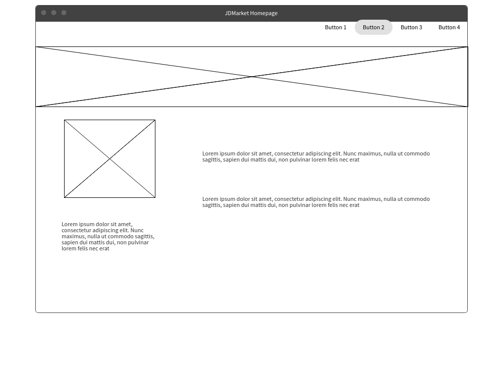
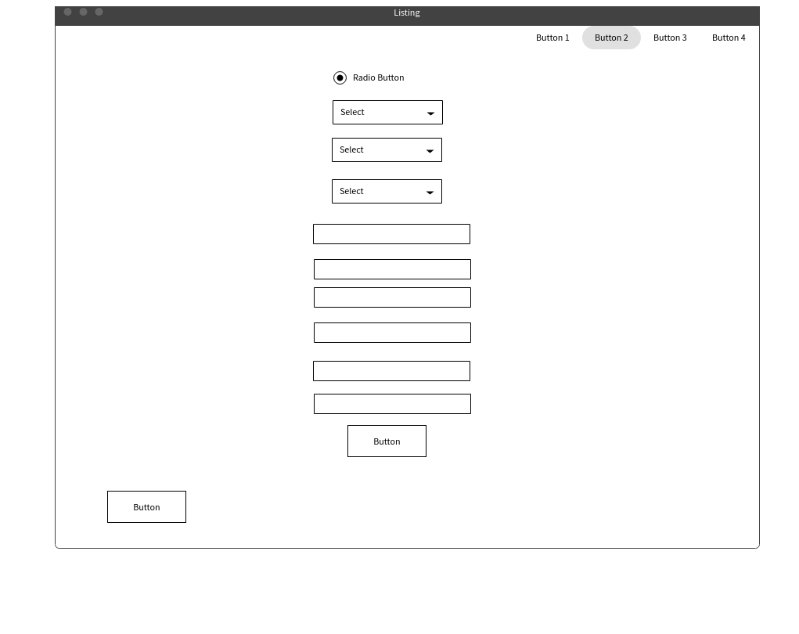
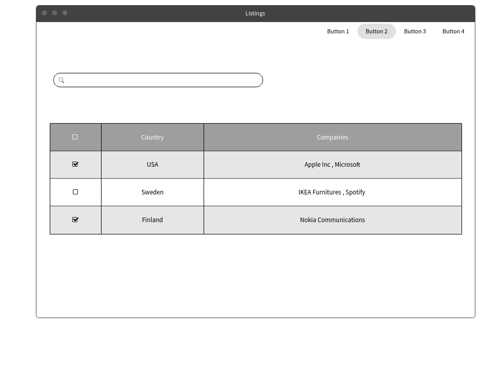
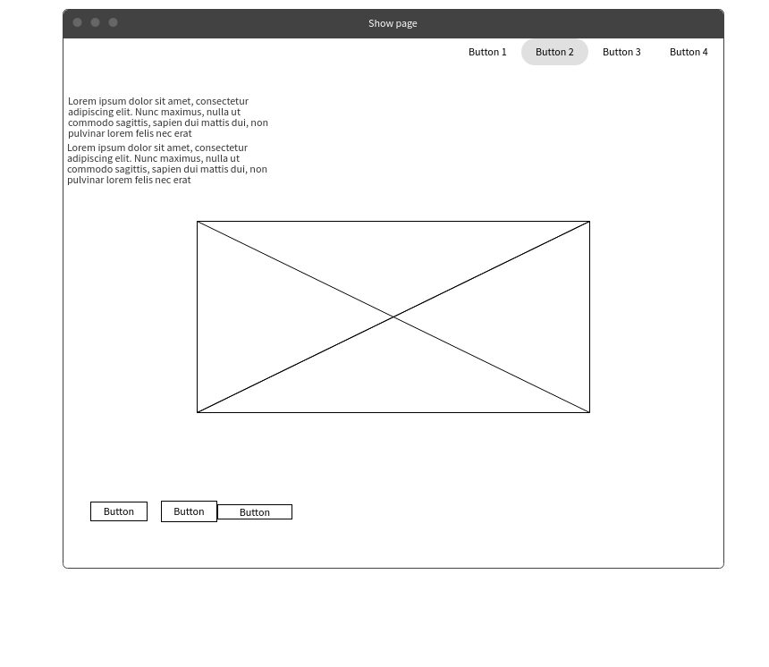


**An ERD for your app**

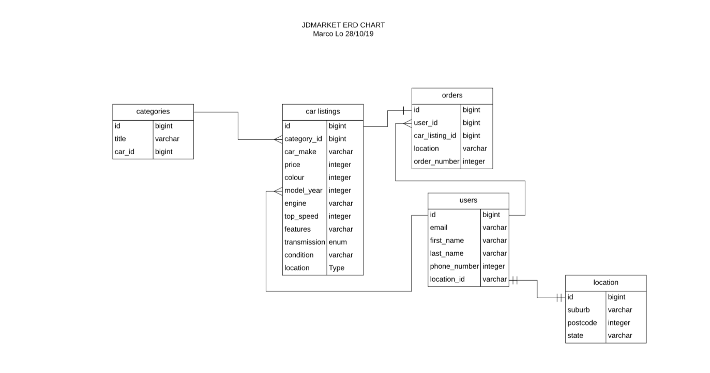

**Explain the different high-level components (abstractions) in your app**

Numerous gems were used in the creation of this Rails project. The Devise gem, was vital in abstracting user authentication within the project. Stripe and AWS was also used for the usability/function for JDMarket. Active record was also used, to allow users and admins a way to manipulate data within the model. 

**Detail any third party services that your app will use**

Third party services that were used includes Stripe and AWS. Stripe was very important in helping store and encrypt sensitive data which is required during a typical payment process by offloading liability on our end. AWS or Amazon Web Service was also used to host images for our site, which was a more secure way of storing data images.  

**Describe your projects models in terms of the relationships (active record associations) they have with each other**

Users have a one_to_many relationship with listings, since a user can have more than one listing while listings can only have one user. Meanwhile, categories also has a has_many relationship with listings, due to the fact that categories can have many listings while listings can only have two categories. 

**Discuss the database relations to be implemented in your application**

A user on JDMarket can create a profile and numerous listings, so both are foreign keys in the user model. In addition to this listings is a foreign key for the categories model, because it references categories to be able to create listings. 

**Provide your database schema design**

Categories schema:

```
create_table "categories", force: :cascade do |t|
    t.string "car_type"
    t.datetime "created_at", null: false
    t.datetime "updated_at", null: false
  end
```

Listings schema:

```
create_table "listings", force: :cascade do |t|
    t.string "car_make", null: false
    t.bigint "price", null: false
    t.string "colour", null: false
    t.integer "model_year", null: false
    t.string "engine", null: false
    t.integer "top_speed", null: false
    t.text "features", null: false
    t.integer "transmission", null: false
    t.text "condition", null: false
    t.string "location", null: false
    t.bigint "category_id"
    t.datetime "created_at", null: false
    t.datetime "updated_at", null: false
    t.string "description"
    t.bigint "user_id"
    t.index ["category_id"], name: "index_listings_on_category_id"
    t.index ["user_id"], name: "index_listings_on_user_id"
  end
```
Users schema:
```
create_table "users", force: :cascade do |t|
    t.string "email", default: "", null: false
    t.string "encrypted_password", default: "", null: false
    t.string "reset_password_token"
    t.datetime "reset_password_sent_at"
    t.datetime "remember_created_at"
    t.datetime "created_at", null: false
    t.datetime "updated_at", null: false
    t.integer "role"
    t.boolean "admin", default: false
    t.string "name"
    t.index ["email"], name: "index_users_on_email", unique: true
    t.index ["reset_password_token"], name: "index_users_on_reset_password_token", unique: true
  end
```

**Describe the way tasks are allocated and tracked in your project**

Trelloboards were used to keep on track of tasks and for better time management. Attached are photos, dictating the usage of trelloboards. An attempt to simplify the board, in hopes to make it less complicated was done. There were 7 main parts in these 2 weeks of working on this project, and theyre all represented by one photo per part. 


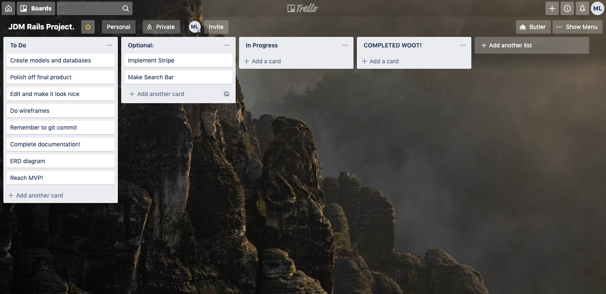
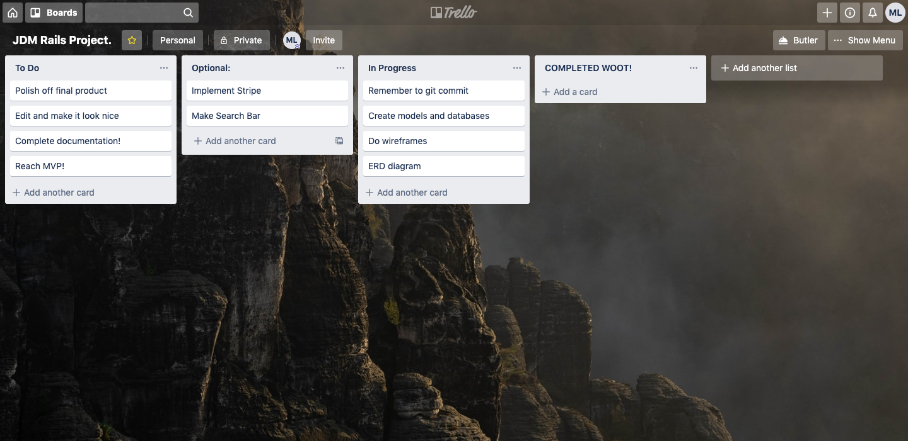
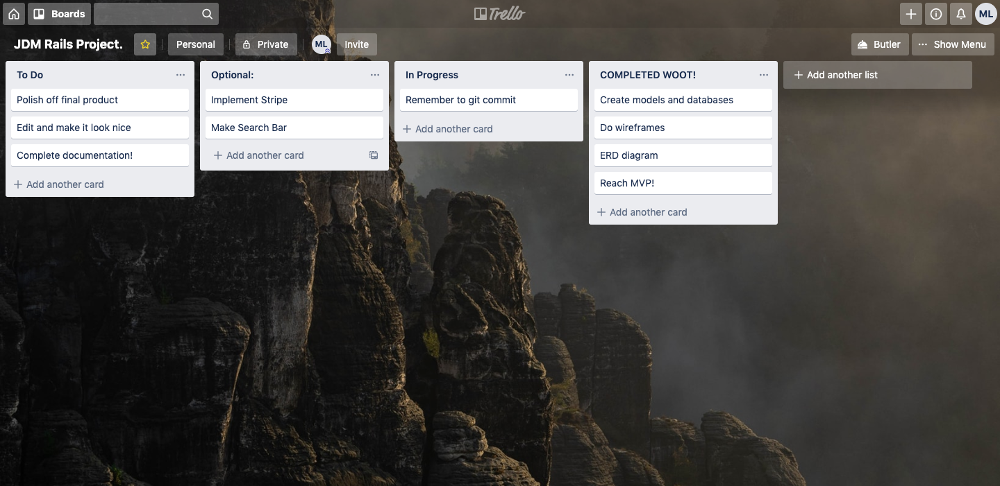

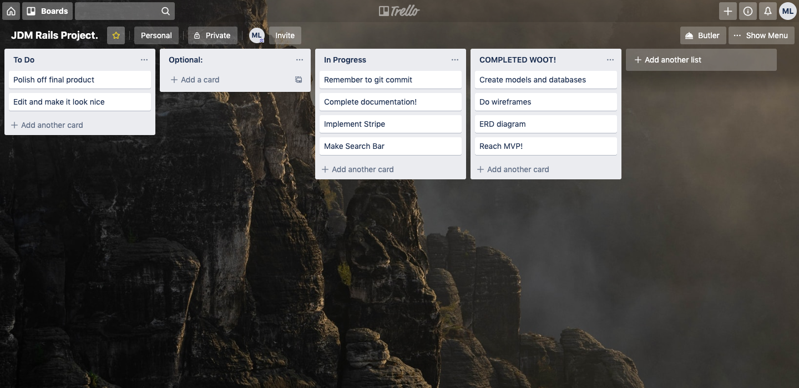
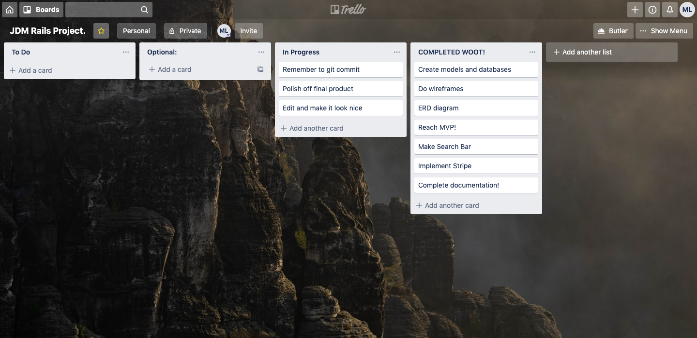
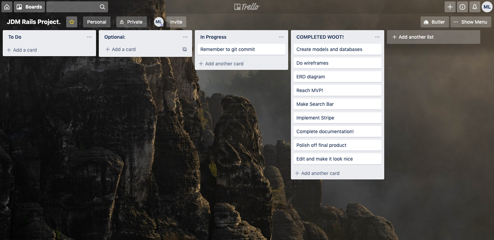


